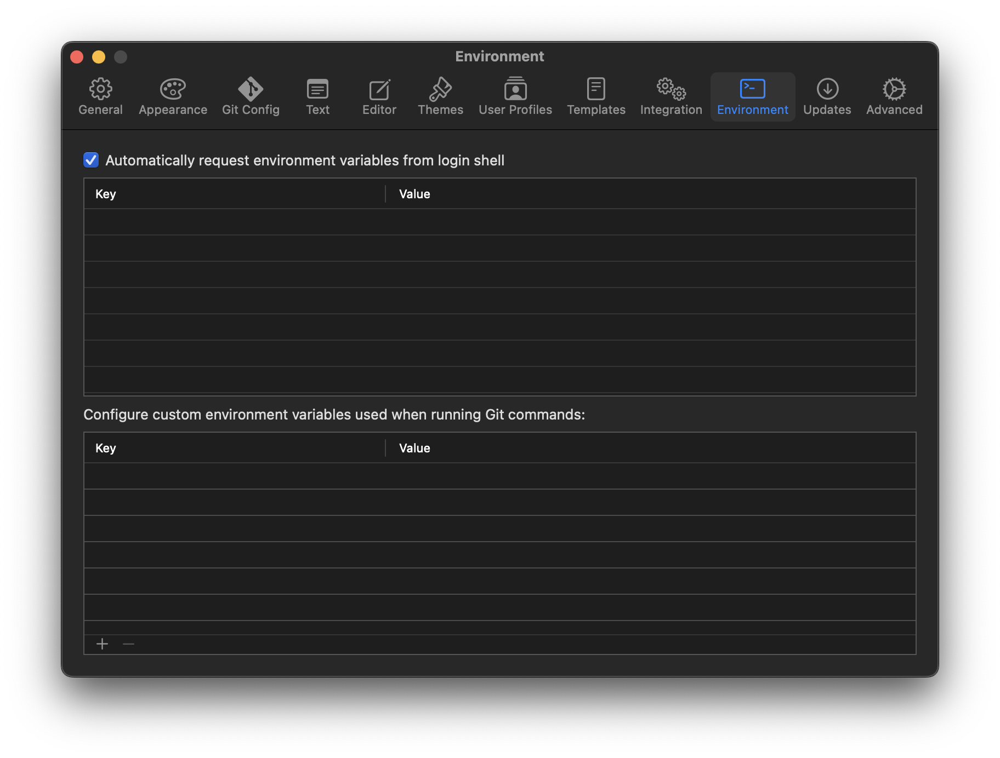

# Commit Message Validation Hook

A lovely little [git hook](https://git-scm.com/docs/githooks) to validate commit messages

## Validations

Commits will be aborted when any of the following conditions exist:

- Empty commit message
- First line of commit message starting with a lowercase letter
- First line of commit message ending with a period
- First line of commit message exceeding 50 character limit
- Second line of commit message not being empty
- Line in body of commit message exceeding 72 character limit

## Installation

```
git clone git@github.com:Tinder/Commit-Message-Validation-Hook.git
cd Commit-Message-Validation-Hook
make install
```

## Repository Setup

Each repository must be individually configured to use the `commit-msg` hook.

**Change Directory**

> Replace `<repositoryPath>` in the command with a path to a locally cloned repository.

```
cd <repositoryPath>
```

**Link**

```
ln -s ~/.git/hooks/commit-msg .git/hooks/commit-msg
```

## Override

When desired, such as when committing a merge commit, the validations may be temporarily bypassed by providing the `--no-verify` option.

```
git commit --no-verify
```

## Spelling

Install [spellcheck-cli](https://github.com/Tinder/spellcheck-cli) to also spell-check commit messages. The `commit-msg` hook will automatically use the `spellcheck` script if installed.

For compatibility with the [Tower](https://git-tower.com) Mac app, ensure the `Automatically request environment variables from login shell` setting is enabled.



## Contributing

While interest in contributing to this project is appreciated, it has been open 
sourced solely for the purpose of sharing with the community. This means we are 
unable to accept outside contributions at this time and pull requests will not 
be reviewed or merged. To report a security concern or vulnerability, please 
submit a GitHub issue.

## License

Licensed under the [Match Group Modified 3-Clause BSD License](
https://github.com/Tinder/Commit-Message-Validation-Hook/blob/main/LICENSE
).
